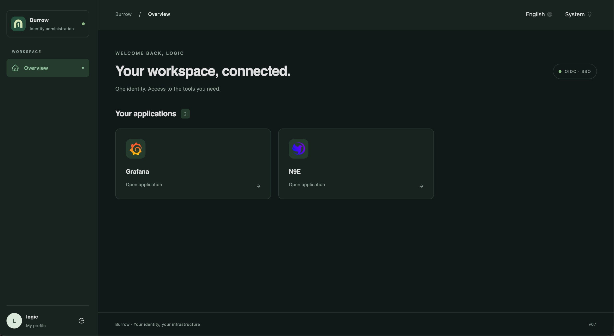
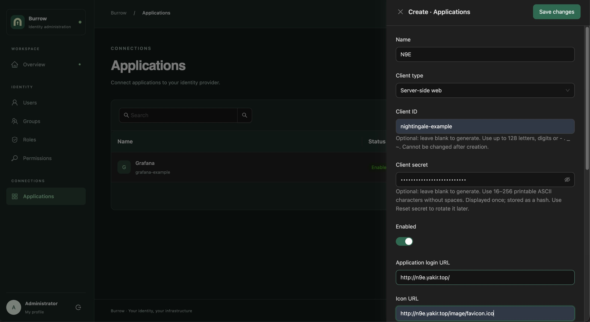
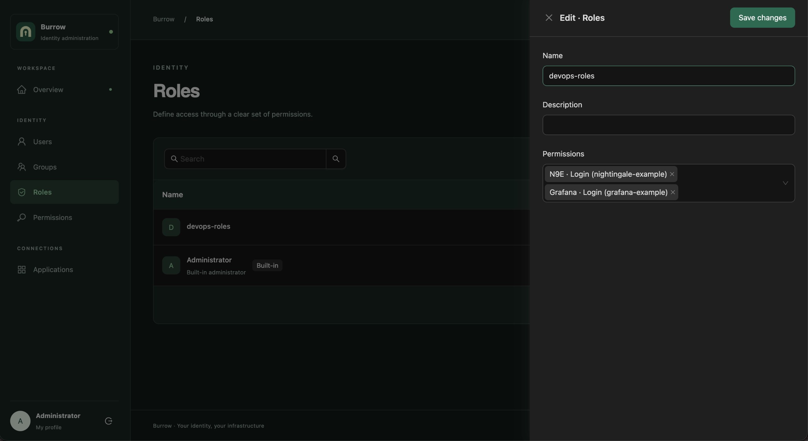
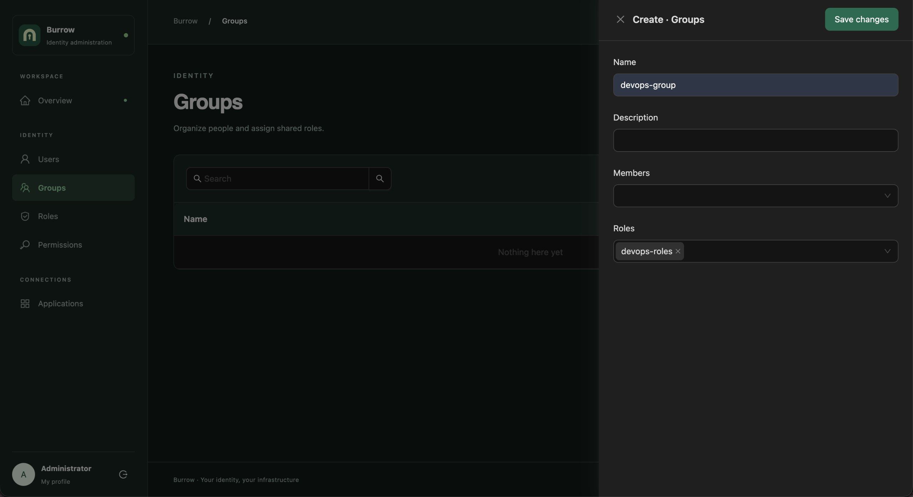
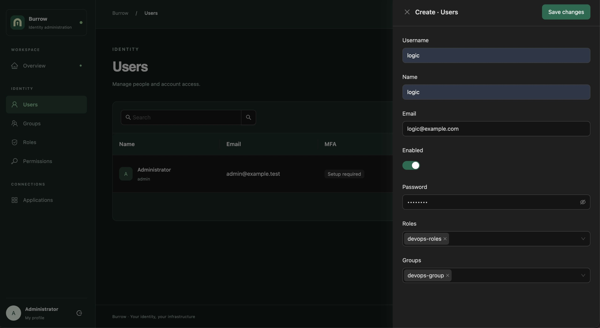

# Burrow

[English](README.md) · 简体中文

**面向小团队和自托管服务的轻量 OIDC 单点登录服务。**

Burrow 帮助你集中管理账户、登录和应用访问权限。用户默认使用 Burrow 密码登录，
MFA 默认关闭，需要时手动开启 TOTP 验证。通过 OpenID Connect 接入支持该协议的应用，
并在个人门户中查看自己可以访问的服务。

项目受 Casdoor 启发，采用独立实现，专注单组织、单实例部署。Go 后端和 React
界面打包为一个 `burrow` 二进制，也提供 Docker Compose 部署方式；生产环境使用
PostgreSQL，开发和测试支持 SQLite，无需 Redis 或消息队列。

- [源码仓库](https://github.com/ArkGravity/burrow) · [v0.1.2 正式版](https://github.com/ArkGravity/burrow/releases/tag/v0.1.2)
- [安装指南](https://github.com/ArkGravity/burrow/releases/download/v0.1.2/INSTALL.md) · [版本说明（含中文）](docs/releases/v0.1.2.md) · [更新记录](CHANGELOG.md)
- [文档索引](docs/README.md) · [配置参考](docs/development/configuration.md) · [OIDC 接入示例](examples/README.md)

## 主要功能

| 功能             | 说明                                                                           |
| ---------------- | ------------------------------------------------------------------------------ |
| 单点登录         | 共享 Burrow 登录会话，支持 Web 和 SPA 应用接入 OIDC                            |
| 密码与多因素认证 | MFA 默认关闭，需手动开启全员 TOTP；支持临时密码改密、管理员重置 MFA 和运维恢复 |
| 用户与用户组     | 集中管理用户、分组及角色分配                                                   |
| 角色与权限       | 通过自定义角色控制管理权限和应用登录权限，支持用户直接授权和用户组授权         |
| 应用门户         | 展示当前用户获准访问的应用，应用自行发起 OIDC 登录                             |
| 管理操作审计     | 管理变更与审计记录在同一事务中提交                                             |
| 个人资料         | 用户可管理自己的资料和密码                                                     |
| 双语与主题       | 支持英文、简体中文，以及浅色、深色和跟随系统主题                               |

Burrow 管理身份与应用访问权限；接入应用中的业务权限和应用自身会话由应用管理。

## 界面预览

以下截图由维护者于 **2026-10-09** 在[本地 SSO 示例](examples/local-sso/README.md)的浏览器人工验收过程中拍摄，使用英文界面与深色主题。普通用户 `logic` 的门户展示已获授权的 Grafana 和 Nightingale 应用。

**普通用户应用门户（深色主题）**



<details>
<summary>创建应用</summary>



</details>

<details>
<summary>配置角色权限</summary>



</details>

<details>
<summary>创建用户组</summary>



</details>

<details>
<summary>创建用户</summary>



</details>

## 安装 v0.1.2

发布产物支持 **Linux amd64 和 arm64**，Docker 根据宿主架构自动选择镜像。推荐使用容器部署。原生二进制要求
glibc 2.36 或更新版本，例如 Debian 12。二进制和容器均已包含前端，运行时无需安装 Go 或 Bun。

从 [Release 页面](https://github.com/ArkGravity/burrow/releases/tag/v0.1.2)
下载部署包 `burrow_v0.1.2_deploy.tar.gz`。`SHA256SUMS` 提供附件校验和，
`IMAGES.txt` 提供镜像及摘要；完整校验步骤见[安装指南](https://github.com/ArkGravity/burrow/releases/download/v0.1.2/INSTALL.md)。

```bash
tar -xzf burrow_v0.1.2_deploy.tar.gz
cd burrow_v0.1.2_deploy
cp .env.example .env

openssl rand -base64 32 # 生成独立的主加密密钥
openssl rand -hex 24    # 生成 PostgreSQL 密码
openssl rand -hex 24    # 生成初始管理员临时密码
```

编辑 `.env`，再启动服务：

- 将 `BURROW_ENV` 设为 `prod`，将 `BURROW_ISSUER` 设为实际的 HTTPS 访问地址。
- 将 `BURROW_MASTER_KEY` 和 `BURROW_BOOTSTRAP_ADMIN_PASSWORD` 设为上面生成的独立值。
- 设置 `POSTGRES_PASSWORD`，并在 `BURROW_DB_DSN` 中使用相同的数据库密码。
- 使用包中固定的 `ghcr.io/arkgravity/burrow:v0.1.2` 镜像；也可切换到 `docker.io/logic3579/burrow:v0.1.2`，或使用摘要固定镜像。
- 配置 TLS 反向代理和实际受信任的代理 CIDR。默认服务端口仅绑定宿主机回环地址，数据库不暴露到宿主机。

```bash
docker compose --profile local-db config --quiet
docker compose --profile local-db pull
docker compose --profile local-db up -d --no-build --pull never
docker compose --profile local-db ps
curl --fail http://127.0.0.1:8080/readyz
```

Compose 按“迁移 → 初始化管理员 → 启动服务”的顺序执行。首次登录使用你配置的管理员账号和临时密码，
按提示修改密码后即可访问门户、管理功能和获授权的 OIDC 应用。MFA 默认关闭；
需要全员 TOTP 时，手动在 `.env` 中设置 `BURROW_MFA_ENABLED=true` 并重建应用容器。

使用外部 PostgreSQL 时，修改数据库连接及 TLS 设置，并省略 `--profile local-db`。
升级前备份数据库、原始主密钥和配置；停止服务时保留数据库卷。
详见[安装指南](docs/releases/INSTALL.md)与[备份、升级和恢复说明](docs/operations/recovery.md)。

## 接入应用

1. 创建用户、用户组和普通角色。
2. 注册 Web 或 SPA 应用，配置精确的回调地址、登录地址及必要的浏览器来源。
3. 将对应的 `app:<应用 ID>:login` 权限加入普通角色，再把角色分配给用户或用户组。
4. 用户在门户中看到获准访问的应用，由应用发起 OIDC 授权请求。

Administrator 是唯一内置角色，具有管理和应用访问权限。新用户默认没有角色；
登录后可以使用个人资料与门户，访问应用需要明确授权。服务端会在授权请求与授权码兑换时重新检查访问权限。

| OIDC 能力     | 当前支持                                                                         |
| ------------- | -------------------------------------------------------------------------------- |
| 服务发现      | `<issuer>/.well-known/openid-configuration`                                      |
| 授权流程      | Authorization Code，默认要求 PKCE S256                                           |
| 客户端认证    | Web：`client_secret_basic`；SPA：`none`                                          |
| Scope         | `openid profile email`                                                           |
| ID Token 签名 | RS256，通过 JWKS 提供公钥                                                        |
| 协议端点      | `/oidc/authorize`、`/oidc/token`、`/oidc/userinfo`、`/oidc/jwks`、`/oidc/logout` |

管理员可以为特定 Web 应用启用 `allowWithoutPkce` 兼容选项；SPA 始终要求 S256，
客户端提交的 PKCE 始终会被验证。回调、登出地址和浏览器来源采用精确匹配。

当前版本使用 Burrow 自身的密码认证，不提供上游身份提供商登录、Refresh Token、
隐式或密码授权模式、机器客户端、动态注册和跨应用统一登出。

- [独立 Web / SPA 示例](examples/README.md)
- [Grafana、Nightingale、Harbor 本地接入说明](examples/local-sso/README.md)
- [OIDC 适配器与协议边界](docs/development/oidc-adapter.md)
- [互操作验证报告](docs/testing/oidc-conformance.md)

上述三个应用的本地 Web 登录曾由维护者手工验收通过；该历史记录不等同于当前生产环境接入验证或 OpenID Foundation 认证。

## 本地开发

需要 Go **1.27.1**、用于 SQLite 驱动的 C 编译器、Bun **1.4.2** 和 Make。
从仓库根目录执行：

```bash
make deps
make migrate
make seed
make run       # 后端：http://localhost:8080
```

另开终端启动前端：

```bash
make web-dev   # 前端：http://localhost:5173
```

开发示例账号为 `admin` / `Burrow-development-admin-2026`，首次登录需修改密码。
MFA 默认关闭；手动开启后，登录时还需绑定并验证 TOTP。
如需自定义初始管理员，请在首次 seed 前修改本地配置。重复 seed 不会重置已有密码、账户状态或授权关系。

原生命令直接读取 YAML，不加载 `.env`。需要本机专用配置时：

```bash
cp configs/config.yaml configs/config.local.yaml
# 编辑本地配置后，对所有命令使用同一配置文件。
make migrate CONFIG=configs/config.local.yaml
make seed CONFIG=configs/config.local.yaml
make run CONFIG=configs/config.local.yaml
```

配置优先级为嵌入默认值、选定的 YAML 文件、已导出的 `BURROW_*` 环境变量。

**默认不开启 MFA**：`security.mfa_enabled` 和 `BURROW_MFA_ENABLED`
默认均为 `false`。需要 MFA 功能时，必须手动在选定的 YAML 文件中开启：

```yaml
security:
  mfa_enabled: true
```

也可以设置环境变量 `BURROW_MFA_ENABLED=true`；Compose 将该变量写入 `.env`
后重建应用容器，原生服务使用 YAML 或导出的环境变量，修改后重启。
开启后所有账户（含管理员）都需完成 TOTP 验证。临时密码始终需要改密，
关闭 MFA 会保留已有绑定；开启后，密码登录产生的会话需重新登录并完成 MFA。
此开关从 v0.1.2 开始提供，历史 v0.1.0/v0.1.1 仍要求 MFA。
从旧版本升级时，若要保留 MFA 要求，请在启动新版前显式设为 `true`。
详见[全局 MFA 配置](docs/development/configuration.md#global-mfa-policy)。
生产环境拒绝公开的示例主密钥和管理员密码；已有数据库必须保留原始主密钥。

## 构建与检查

```bash
make help             # 查看可用命令
make build            # 构建前端和内嵌前端的 bin/burrow
make check            # Go 静态检查、race 测试和前端检查
make browser-install
make test-e2e         # Chromium、MFA 和独立 Web / SPA OIDC 流程
```

`make test-db` 需要 `BURROW_TEST_POSTGRES_DSN` 指向专用测试数据库，
并具备创建 schema 的权限。未配置时，`make test` 会跳过 PostgreSQL 子测试。
浏览器测试使用临时 SQLite 数据和本地端口 18080、19001、19002。

## 项目结构与文档

| 目录               | 内容                                                |
| ------------------ | --------------------------------------------------- |
| `cmd/burrow/`      | 服务、迁移、初始化、签名密钥轮换和 MFA 运维恢复命令 |
| `internal/burrow/` | 身份模型、权限、会话、MFA、OIDC 适配和数据库测试    |
| `configs/`         | YAML 默认配置及嵌入配置                             |
| `web/`             | React、TypeScript、Ant Design 和 Vite 前端          |
| `examples/`        | 独立 OIDC 客户端和本地 SSO 集成示例                 |
| `docs/`            | 配置、运维、验证、发布和设计记录                    |

详细技术与运维文档目前以英文为主，可从[文档索引](docs/README.md)进入。
CI 在 Linux amd64 和 arm64 原生 runner 上检查 SQLite / PostgreSQL、浏览器流程和容器构建，
并执行前端与静态检查；全部通过后向 GHCR 和 Docker Hub 发布双架构镜像。
Release 分别测试两种架构的二进制与容器，发布独立二进制包和共享 Compose 部署包。
v0.1.2 的双架构 CI 与 Release 已通过并正式发布；历史 v0.1.0 仍仅提供 amd64。
查看 [CI 与镜像发布](docs/development/ci.md)、[MFA 与恢复](docs/development/mfa-proposal.md)
和[发布流程](docs/development/releases.md)。

## 许可证

Burrow 使用 [MIT 许可证](LICENSE)，允许商业使用、修改、分发和闭源使用，需保留许可证和版权声明。
v0.1.0 是首个正式发布版本；后续升级可能涉及配置、API 或数据库迁移。
